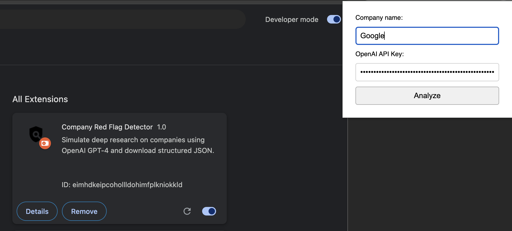

# Company Red Flag & Risk Investigation (brief "due diligence")

Proof of Concept of web extension to automate brief due diligence using OpenAI API.

It analyzes any company and generates a structured JSON report for risk, legal, financial, executive, and reputation checks.

## Extension Screenshot




## Simplified Application Diagram


## How `risk_score` Works

The `risk_score` is **not calculated** in this version, but **generated by GPT-4** based on its reasoning from the other fields in the JSON output.

GPT-4 evaluates fields like:
- `financial_issues`
- `legal_issues`
- `executive_changes`
- `reputational_risks`
- `political_lobbying`

It then synthesizes a realistic score from **1 to 5**, even if some data is missing or simulated.

---

### GPT-4 likely interprets `risk_score` like this:

| Risk Score | Meaning        | Triggers GPT might detect                                      |
|------------|----------------|----------------------------------------------------------------|
| 1          | Low risk       | No red flags, solid reputation, stable leadership              |
| 2          | Low-moderate   | Minor news mentions or ownership ambiguity                     |
| 3          | Medium          | Lack of transparency, recent exec changes, moderate risks      |
| 4          | High            | Legal issues, layoffs, known lobbying influence                |
| 5          | Critical        | Major lawsuits, scandals, bankruptcies, opaque ownership       |

---

> Future versions may support custom logic for scoring or let users manually adjust the risk score after reviewing the analysis.

### Features (done/to do):

---

## Features

- Analyze companies with OpenAI using a simulated corporate due diligence prompt
- Download results as JSON
- Securely store OpenAI API Key in Chrome storage
- Supports investigation responses based on GPT-4 knowledge
- Lightweight and private, runs fully in browser

---

## Prompt System (Planned Features)

### Core Functionality

- [ ] Allows use multiple APIs and combine the results (e.g., Perplexity, Gemini, DeepSeek, Claude, etc.)
- [ ] Support real-time research using Perplexity or Serper API
- [ ] Preview and edit prompt results before download or insertion (Google Sheets)
- [ ] Gives users choice between default and custom prompts  
- [ ] Stores custom prompts securely with Chrome storage  
- [ ] Maintains default prompts as fallback  
- [ ] Supports template variables (`{{company}}`, `{{industry}}`, `{{country}}`)  
- [ ] Allows prompt resetting to default  
- [ ] Validates basic prompt structure before sending  

### UX/UI Enhancements

- [ ] Add risk score radar chart
- [ ] Export data directly to Google Sheets or Drive
- [ ] Shows helpful previews before submitting to OpenAI
- [ ] Toggle between default/custom prompts
- [ ] Save multiple prompt versions (per use case)
- [ ] Reset to defaults
- [ ] Maintain prompt history across sessions
- [ ] Allows bulk analysis through upload CSV of company names to run batch analysis

### Advanced Logic

- [ ] Maintain different prompts for different use cases (e.g., fintech, biotech, compliance, etc.)  
- [ ] Handle template variable substitution dynamically
- [ ] Validate prompt content format before submission  
- [ ] Fallback to defaults if custom prompt is empty or invalid  
- [ ] Encrypt stored prompts using Chrome’s built-in security  

---

## Installation

1. Clone or download this repository  
2. Go to `chrome://extensions` in your browser  
3. Enable **Developer Mode** (top-right)  
4. Click **"Load unpacked"** and select this extension folder  
5. Click the icon in your toolbar to start analyzing companies 

---

## Tech Stack

- HTML, CSS, JavaScript  
- Chrome Extension APIs (`storage`, `action`)  
- [OpenAI API](https://platform.openai.com/docs/api-reference) (GPT-4)  

---


## Default prompt:

```txt
Act like a corporate expert investigator. Conduct a thorough investigation of the company [COMPANY NAME], including its subsidiaries, leadership, and recent activity, with a focus on identifying red flags, legal issues, financial instability, lobbying influence, or reputational risks. Your goal is to determine whether this company is a reliable, transparent, and viable partner for long-term technology or AI-related service provision.

Scope of Information (Prioritize Free Sources Where Possible)

Corporate Registry & Legal Status

Verify official company name, registration number, headquarters, incorporation date, active/inactive status

Sources:
- OpenCorporates
- European e-Justice Portal
- Dun & Bradstreet
- Transparency Register EU
- Corporate Structure & Ownership

Check ultimate beneficial owners, shareholders, subsidiaries, mergers/acquisitions

Sources:
- OpenCorporates
- Orbis (Moody’s, partial access)
- Crunchbase
- Europages
- Financial Standing & Credit Risk

Look for bankruptcies, credit downgrades, major debts, unpaid taxes, or insolvency filings

Sources:
- Yahoo Finance
- DNB Basic Reports
- AnnualReports.com (if public)
- Moody's (where available)
- Legal Proceedings & Compliance


Investigate legal cases, sanctions, environmental violations, or regulatory non-compliance

Sources:
- EU e-Justice
- National court registries
- News portals (Reuters, AP, local business news)
- Lobbying & Political Influence

Examine lobbying activities, political donations, and government relationships

Sources:
- LobbyFacts.eu
- EU Transparency Register
- Reputation & News Mentions

Search for negative press, executive scandals, public boycotts, or major layoffs

Sources:
- Google News
- Reuters, Bloomberg, AP
- Trustpilot or Glassdoor (for employee & customer sentiment)
- Technology & Industry Footprint


Investigate tech usage, patents, AI initiatives, and whether they outsource/partner in AI

Sources:
- Crunchbase
- Y Combinator
- Company website & LinkedIn
- GitHub (if applicable)


Red Flags to Watch For
Frequent executive turnover, ongoing or recent lawsuits, tax evasion or shady offshore structures, negative media exposure, political lobbying with no transparency, unclear or overly complex ownership structures, poor financial ratios or loss declarations, connections to sanctioned individuals/entities.

```


Response for "Google":

```json
{
  "company_profile": {
    "name": "Google LLC",
    "registration_number": "C2474134",
    "headquarters": "Mountain View, California, USA",
    "incorporation_date": "October 22, 2002",
    "status": "Active",
    "ultimate_beneficial_owners": "Alphabet Inc.",
    "subsidiaries": "YouTube, Android, DoubleClick, Verily, Waymo, Fitbit, etc.",
    "recent_mergers_acquisitions": "Fitbit, Looker, Alooma, etc."
  },
  "financial_issues": {
    "bankruptcies": "None",
    "credit_downgrades": "None",
    "major_debts": "None",
    "unpaid_taxes": "Allegations of tax avoidance in several countries",
    "insolvency_filings": "None"
  },
  "legal_issues": {
    "legal_cases": "Anti-trust cases in EU and US, Privacy related issues across the globe",
    "sanctions": "EU anti-trust fine",
    "environmental_violations": "None",
    "regulatory_non-compliance": "Data protection and privacy issues"
  },
  "executive_changes": {
    "CEO": "Sundar Pichai since 2015",
    "CFO": "Ruth Porat since 2015",
    "major_changes": "Larry Page and Sergey Brin stepped down from Alphabet Inc. in 2019"
  },
  "reputational_risks": {
    "negative_press": "Privacy issues, Anti-trust cases, Tax avoidance allegations",
    "executive_scandals": "Sexual harassment allegations leading to executive departures",
    "public_boycotts": "Protests against Project Maven",
    "major_layoffs": "None"
  },
  "political_lobbying": {
    "lobbying_activities": "One of the biggest spenders in US on lobbying",
    "political_donations": "Donations to both Democratic and Republican parties",
    "government_relationships": "Close relationships with US government and EU"
  },
  "technology_industry_footprint": {
    "tech_usage": "Extensive usage of AI and machine learning",
    "patents": "One of the top companies in terms of number of patents",
    "AI_initiatives": "DeepMind, Google Brain, AI for Social Good",
    "outsourcing_partner_in_AI": "No, they are leaders in AI"
  },
  "risk_score": 2
}

```
